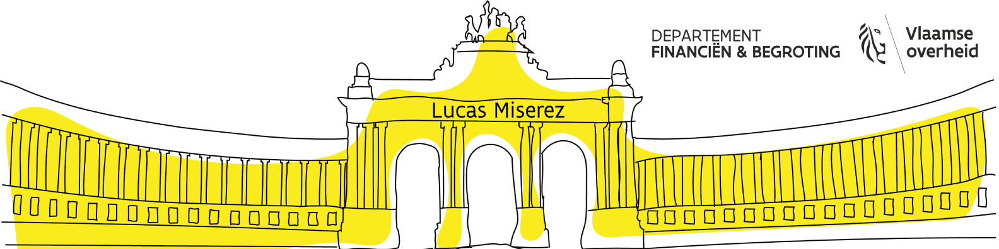

# Hi, I'm Lucas 👋

I'm a 21-year-old programmer with a deep passion for web and software development. I also have a knack for automating processes, a strong affinity for Linux and a love for all things open-source.

## About Me

- 🌐 **Web Developer:** I love creating beautiful and functional websites. HTML, CSS and JavaScript are my best friends.

- 💻 **Software Developer:** Writing code that solves real-world problems is my passion. I'm proficient in languages like C#, Python, Java, JavaScript and more.

- 🤖 **Automation Enthusiast:** I enjoy streamlining tasks and processes through automation scripts and tools.

- 🐧 **Linux Lover:** Linux is my preferred OS. I'm always learning new tricks to master the penguin.

- 🔓 **Open Source Advocate:** I believe in the power of community-driven development. I contribute to open-source projects whenever I can.

- 🚆 **Train Enthusiast:** Trains are not just a mode of transport; they're a fascination. Railways, locomotives and all things train-related intrigue me.
  

Feel free to explore my repositories and reach out if you have any questions or collaborations in mind. Let's code and automate together!

<a href="https://cv-lucasmiserez.vercel.app/" target="_blank">View My CV</a>

---

*This README is under constant development, just like my projects. Stay tuned for more updates!*

&nbsp;

